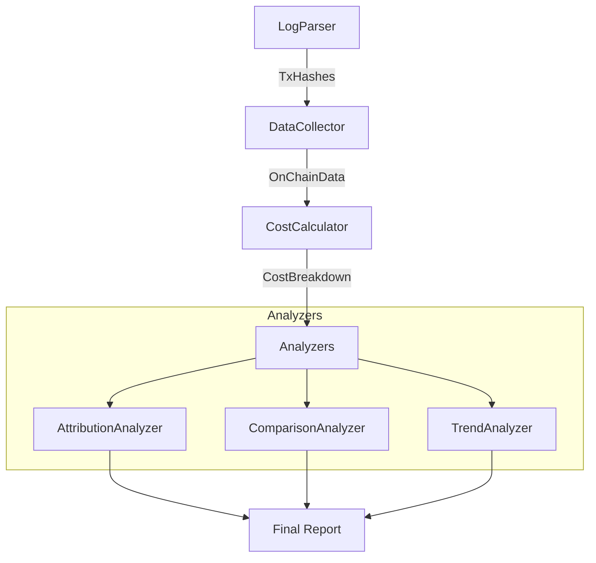

# 📊 AAStar Gas Analytics

Advanced gas analysis and cost attribution engine for AAStar Paymaster ecosystem.

## Features

- **Double-Layer Analysis**:
  - **Intrinsic Layer**: Pure EVM gas consumption and efficiency (Academic view).
  - **Economic Layer**: Real-world USD costs, protocol revenue, and profit margins (Business view).
- **Competitor Benchmarking**: Comparison against L2s (Optimism, Arbitrum) and other Paymasters (Alchemy, Pimlico).
- **Trend Analysis**: Historical gas price trends and optimal execution windows.
- **Profit Tracking**: Accurate calculation of protocol profit (`Markup + Buffer - Cost`).

## Quick Start

1. **Configure Environment**
   Ensure `.env.sepolia` (or relevant network env) exists with RPC URL:
   ```env
   SEPOLIA_RPC_URL=https://...
   ```

2. **Run Analysis**
   ```bash
   # Analyze recent transactions from logs
   npx tsx packages/analytics/src/gas-analyzer-v4.ts
   
   # Analyze specific transaction hash (Development)
   npx tsx packages/analytics/src/cli.ts analyze 0x...
   ```

## Architecture



## detailed Metrics

### Protocol Profit
Profit is calculated as:
```
Profit = UserPaidUSD - L1GasCostUSD
```
Where `UserPaidUSD` is derived from:
- **SuperPaymaster**: `aPNTsConsumed * aPNTsPrice ($0.02)`
- **Paymaster V4**: `TokenCost` (USD value) or `ETH Cost`

### L2 Simulation
Simulates cost if the same UserOp were executed on Optimism:
```
L2Cost = (ExecutionGas * L2GasPrice) + (CalldataSize * L1GasPrice * Scalar)
```

## License
MIT

二、数据源清单
2.1 已有数据（可直接利用）
数据源	位置	内容	格式
历史交易日志	logs/*.log	45+ 个回归测试日志，包含 tx hash、UserOp hash、测试结果	文本日志
链上区块数据	Sepolia RPC	Transaction Receipt、Event Logs、Gas 消耗	JSON-RPC
合约 ABI	packages/core/src/abis/	SuperPaymaster, PaymasterV4, EntryPoint 等 ABI	JSON
SDK Actions	packages/core/src/actions/	合约调用封装，可用于查询状态	TypeScript
2.2 外部基准数据（需爬取/API）
数据源	URL	用途	更新频率
L2 Gas 费用	https://l2fees.info	对比各 L2 的平均 UserOp 成本	每日抓取
Paymaster 市场	https://www.bundlebear.com/erc4337-paymasters/all	对比 Pimlico、Alchemy 等的总支出和服务量	每周抓取
ETH 价格	CoinGecko API	将 Gas 消耗转换为 USD	实时/每小时
Chainlink 喂价	Sepolia Chainlink Feed	验证 Oracle 更新频率对成本的影响	链上查询
2.3 缺失数据（需补充）
Bundler 收益明细：需要从 Bundler 提供商（Alchemy/Pimlico）获取详细账单（如果可用）
协议运营成本：
Oracle 更新频率和 Gas 消耗（可从 SuperPaymaster 的 updatePrice 调用历史统计）
Treasury 和 Staking 相关的管理成本
用户行为数据：不同社区的 xPNTs 消耗模式（需从 Event Logs 中提取）
三、分析维度与指标体系
3.1 单笔交易成本分解
总成本 = L1执行成本 + L2数据成本 + 协议附加成本
指标定义：
指标	计算公式	单位	数据来源
L1 Gas 消耗	gasUsed	gas	Transaction Receipt
有效 Gas 价格	effectiveGasPrice	wei	Transaction Receipt
ETH 支付	gasUsed × effectiveGasPrice	ETH	计算
USD 价值	ETH支付 × ETH_PRICE	USD	ETH 价格 API
aPNTs 消耗	TransactionSponsored Event 第一个参数	aPNTs	Event Log
xPNTs 扣除	TransactionSponsored Event 第二个参数	xPNTs	Event Log
aPNTs USD 价值	aPNTs消耗 × aPNTsPriceUSD	USD	SuperPaymaster 状态
xPNTs USD 价值	xPNTs扣除 × xPNTsPrice (*)	USD	xPNTsFactory + exchangeRate
(*) xPNTsPrice = aPNTsPriceUSD / exchangeRate

V4 vs SuperPaymaster 对比：
V4：仅消耗 GasPaymentProcessed Event 中的 PNT
SuperPaymaster：消耗 aPNTs（协议层）+ xPNTs（用户层）
3.2 成本归因（收益分配）
L1执行成本 (100%) 分解为：
├─ Bundler 收益: (baseFee + priorityFee) × gasUsed
├─ L2 数据压缩节省: (L1_Gas_If_No_Compression - Actual_L1_Gas) × L1_GasPrice
├─ 协议固定成本: Oracle更新（分摊到每笔交易）
└─ AAStar 服务费: (aPNTs消耗 - 实际L1成本等价aPNTs) × aPNTsPriceUSD
细化指标：
角色	收益来源	计算方法
Bundler	优先费 + 基础费	(baseFee + priorityFee) × gasUsed
协议 Treasury	aPNTs 销毁	aPNTs消耗 × aPNTsPriceUSD - L1成本USD
社区 Operator	xPNTs 收入	xPNTs扣除 × xPNTsPrice
AAStar 服务费	协议层利润	Treasury收益 - 运营成本
3.3 Gas 效率对比
对比维度	基准	AAStar 实际	比值
vs 普通 ERC20 转账	~21,000 gas	~170,000 gas	8.1x
vs OP Mainnet UserOp	$0.02/op	$0.62/op (当前)	31x
vs Arbitrum UserOp	$0.64/op	$0.62/op	0.97x (持平)
vs Pimlico (全链平均)	~$0.037/op	$0.62/op	16.7x
3.4 时序分析（历史趋势）
Gas Price 波动影响：统计不同时间段的 effectiveGasPrice 变化
协议成本演进：对比 V4 和 SuperPaymaster 在不同测试批次中的成本差异
Oracle 更新成本：分析 updatePrice 调用频率和分摊成本
四、技术实现方案
4.1 模块架构设计
packages/analytics/
├── src/
│   ├── core/
│   │   ├── DataCollector.ts       # 数据采集：从 logs 和链上提取
│   │   ├── CostCalculator.ts      # 成本计算引擎
│   │   ├── BenchmarkLoader.ts     # 外部基准数据加载
│   │   └── ReportGenerator.ts     # 报告生成器
│   ├── analyzers/
│   │   ├── TransactionAnalyzer.ts # 单笔交易深度分析
│   │   ├── AttributionAnalyzer.ts # 成本归因分析
│   │   ├── ComparisonAnalyzer.ts  # 行业对比分析
│   │   └── TrendAnalyzer.ts       # 历史趋势分析
│   ├── exporters/
│   │   ├── MarkdownExporter.ts    # Markdown 报告导出
│   │   ├── JSONExporter.ts        # 结构化数据导出
│   │   └── CSVExporter.ts         # CSV 数据集导出
│   ├── utils/
│   │   ├── LogParser.ts           # 日志文件解析器
│   │   ├── EventDecoder.ts        # Event Log 解码
│   │   └── PriceOracle.ts         # ETH/Token 价格查询
│   └── gas-analyzer.ts            # 主入口（现有文件升级）
├── data/                           # 缓存和基准数据
│   ├── industry_baseline_latest.json
│   ├── eth_price_cache.json
│   └── transaction_cache/          # 链上数据缓存
└── reports/                        # 生成的报告输出
    ├── daily/
    ├── full/
    └── academic/

## Classes

- [AnalyticsClient](classes/AnalyticsClient.md)
