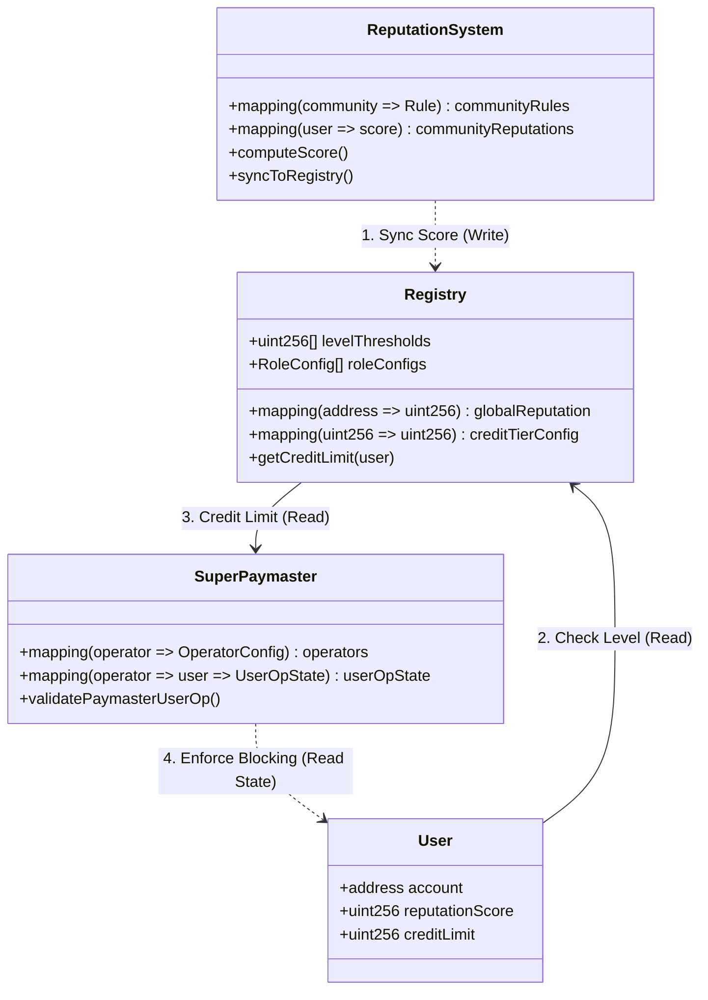

# Reputation-to-Credit 技术映射白皮书

## 1. 设计初衷与哲学 (Design Philosophy)

AAStar 协议的核心愿景是构建一个“赋能社区、简化开发”的账户抽象基础设施。在这个体系中，**Reputation (声誉)** 和 **Credit (信用/授信)** 是连接链上资产与社交共识的桥梁。

### 核心理念：
- **Reputation 是主观度量**：它代表了社区成员之间的共识。声誉不是单纯的数字，而是基于用户活动（Entropic Factor）和社交关系（Social Graph）的综合评分。
- **Credit 是经济表现**：信用是将主观声誉转化为客观支付能力的机制。通过信用系统，用户可以“预支”Gas 费用，实现真正的无感交互。
- **去中心化的安全底线**：通过 DVT (Distributed Validator Technology) 和 BLS 聚合签名，确保声誉的更新不依赖于任何单一中心化实体。

---

## 2. 技术架构与映射逻辑

### 2.1 声誉增长路径 (The Three Tiers)

系统设计了三种平行的声誉更新路径，以适应不同的信任级别：

| 级别 | 名称 | 触发逻辑 | 验证机制 | 适用场景 |
| :--- | :--- | :--- | :--- | :--- |
| **Tier 1** | **Manual Inject** | 管理员手动设定 | 合约 Owner 权限 | 测试、紧急干预、初始数据导入 |
| **Tier 2** | **Rule-based Sync** | 链上规则自动累加 | 预定义智能合约算法 | 质押奖励、固定活动积分 |
| **Tier 3** | **DVT Batch Sync** | 离线计算批量同步 | **BLS256 聚合签名证明** | 生产环境、综合行为建模、跨链声誉 |

### 2.2 映射模型：从分数到额度

声誉分数的转换遵循以下三级映射：

1.  **Reputation Score (25分)**: 用户在特定社区或全局的活动积分。
2.  **Credit Level (Level 2)**: 在 `Registry` 中注册的等级阈值。
    - *配置示例*：Level 1 (>10分), Level 2 (>20分), Level 3 (>50分)。
3.  **Credit Limit (100 aPNTs)**: 每个等级对应一个全局的基础信用额度。
4.  **Community Limits (xPNTs)**: 各社区可基于全局额度进行微调或设置黑名单。

---

## 3. 用户场景与活动路径

### 场景 A：终端用户 Gasless 体验 (End-user Flow)
1.  **活动产生**：用户在 App 内完成每日签到。
2.  **声誉增长**：`ReputationSystem` 根据 Tier 2 规则自动计算分数增长。
3.  **信用变现**：用户发起交易，`SuperPaymaster` 发现该用户 `Credit Level` 已达标。
4.  **代付执行**：`SuperPaymaster` 为用户垫付 Gas，并在 `xPNTsToken` 中记录债务（Debt）。
5.  **自动偿还**：当用户获得新的社区激励（Mint）时，债务先于余额自动扣除。

### 场景 B：社区管理员配置 (Admin Flow)
1.  **启动社区**：通过 `createCommunityClient` 启动并部署社区专属 `xPNTsToken`。
2.  **定义规则**：调用 `ReputationSystem.setRule` 设置“质押 100 GT 每日增 1 分”的规则。
3.  **设置阈值**：在 `Registry` 中定义不同信用等级对应的 Airdrop 权限。

### 场景 C：生产级去中心化同步 (DVT Consensus Flow)
1.  **离线分析**：DVT 节点群分析用户的跨链及链上行为。
2.  **共识签名**：多个 DVT 节点对更新后的声誉列表进行 BLS 签名。
3.  **批量注入**：调用 `Registry.batchUpdateGlobalReputation`。合约在毫秒内验证 BLS 证明。
4.  **权限锁死**：Owner 权限收缩，确保非 DVT 签名的声誉更新会被拒绝。

---

## 4. 关键初始化配置 (Default Setup)

为了确保系统的“开箱即用”且安全，我们预设了以下基准配置：

- **基础信用阈值 (Level Thresholds)**:
  - Level 1: 13 points (入门级，支持基础转账代付)。
  - Level 2: 50 points (高级用户，支持复杂合约交互)。
- **信用额度配额 (Credit Tiers)**:
  - Level 1 Limit: 等值 $10 USD 的 aPNTs。
  - Level 2 Limit: 等值 $50 USD 的 aPNTs。
- **安全拦截器 (Safety Interceptor)**:
  - `SuperPaymaster` 采用**被动黑名单机制**。即使额度足够，若 DVT 标记 `isBlocked=true`，交易仍会被拒绝。

---

## 5. 结论

Reputation-to-Credit 映射不仅是一套算法，它是 AAStar 网络治理的核心。它通过将“社交声誉”转化为“链上信用”，解决了 Web3 用户进入门槛高的痛点，同时利用 DVT 技术确保了这套信用体系的公正与去中心化。

---

## 6. 核心数据结构与关系映射 (Core Data Structures & Relationships)

为了深入理解系统如何从底层数据层面支撑声誉到信用的转换，本节整理了三大核心合约的关键数据对象及其交互关系。

### 6.1 对象关系图 (Object Relationship Diagram)



### 6.2 核心数据对象 (Key Data Objects)

#### A. Registry (Single Source of Truth)
Registry 是整个系统的状态中心，存储了用户的全局声誉和信用配置。

| 数据结构 | 类型 | 描述 | 关键字段 (Struct/Field) |
| :--- | :--- | :--- | :--- |
| **Global Reputation** | `mapping` | 所有用户的全局声誉分 | `globalReputation[user] => uint256 score` |
| **Credit Tiers** | `mapping` | 等级与信用额度的映射 | `creditTierConfig[level] => uint256 limit (aPNTs)` |
| **Level Thresholds** | `array` | 晋升等级所需的分数线 | `levelThresholds[] = [13, 34, 89...]` |
| **Role Config** | `struct` | 角色行为定义 | `minStake`, `exitFeePercent`, `roleLockDuration` |

#### B. ReputationSystem (Calculation Engine)
负责计算分数的逻辑层，支持规则定义和即时计算。

| 数据结构 | 类型 | 描述 | 关键字段 (Struct/Field) |
| :--- | :--- | :--- | :--- |
| **Rule** | `struct` | 社区定义的声誉获取规则 | `baseScore`, `activityBonus`, `maxBonus` |
| **Community Rules** | `mapping` | 社区特有规则集 | `communityRules[community][ruleId] => Rule` |
| **Score Cache** | `mapping` | 社区内局部声誉缓存 | `communityReputations[community][user] => uint256` |

#### C. SuperPaymaster (Execution Layer)
根据 Registry 的数据执行支付逻辑，并维护自身的风险控制状态。

| 数据结构 | 类型 | 描述 | 关键字段 (Struct/Field) |
| :--- | :--- | :--- | :--- |
| **OperatorConfig** | `struct` | Paymaster 运营商配置 | `aPNTsBalance`, `exchangeRate`, `isPaused` |
| **UserOpState** | `struct` | 压缩的用户状态(省Gas) | `uint48 lastTimestamp`, `bool isBlocked` |
| **PriceCache** | `struct` | 代币价格预言机缓存 | `int256 price`, `uint256 updatedAt` |

### 6.3 数据流转逻辑 (Data Flow)

整个信用体系的数据流转遵循 **"计算 -> 存储 -> 消费"** 的闭环：

1.  **计算 (Compute)**: `ReputationSystem` 根据 `Rule` 和用户活动（Activities）计算出 `communityScore`。
2.  **同步 (Sync)**: 通过 `syncToRegistry` 或 DVT 共识，将计算结果写入 `Registry.globalReputation`。
3.  **映射 (Map)**: `Registry` 内部通过 `levelThresholds` 将分数动态映射为 `Credit Level`。
4.  **消费 (Consume)**: 用户发起交易时，`SuperPaymaster` 调用 `Registry.getCreditLimit(user)` 获取最新的信用额度。
5.  **校验 (Validate)**: `SuperPaymaster` 结合自身的 `UserOpState` (是否被屏蔽、频率限制) 和额度，决定是否为该 UserOperation 支付 Gas。

---

## 7. 深度解析：多社区协同与算法聚合 (Deep Dive: Multi-Community Aggregation)

本节通过具体的用户案例（Alice）和运营视角，解析声誉系统如何在去中心化的环境下处理多源数据。

### 7.1 用户视角：Alice 的多重身份 (The User Journey)

假设用户 **Alice** 加入了三个不同的 DAO 社区，并在每个社区通过不同的行为积累声誉。

#### A. 行为记录
| 社区 | 角色/身份 | 参与活动 (Activity) | 原始积分 |
| :--- | :--- | :--- | :--- |
| **Panda DAO** | 治理成员 | **投票 (Vote)**: 参与了 15 次治理投票 | 150 pts |
| **Dev Guild** | 开发者 | **代码贡献 (PR)**: 合并了 3 个 PR | 300 pts |
| **Charity Fund**| 捐赠者 | **捐款 (Donate)**: 捐赠了 0.5 ETH | 500 pts |

#### B. 数据展示与查询
Alice 不需要去三个不同的应用查看积分。通过 Aggregator（聚合器）前端或 SDK，她可以调用统一的 ABI 获取全视图：
- **查询单社区分**：`ReputationSystem.calculateReputation(Alice, PandaDAO, 0)` -> 返回 `150`。
- **查询全局分**：`Registry.globalReputation(Alice)` -> 返回聚合后的总分（如 `950`）。
- **查询明细**：`ReputationSystem.getReputationBreakdown(Alice, DevGuild, ...)` -> 返回 `baseScore`, `activityBonus` 等。

### 7.2 运营视角：规则配置 (Operator Configuration)

三个社区的 Operator (运营者账户) 可以在不修改合约代码的情况下，通过 ABI 设置各自的激励规则。

#### A. 规则定义 (Rule Definition)
通过调用 `ReputationSystem.setRule(bytes32 ruleId, uint base, uint bonus, uint max, string desc)`：

1.  **Panda DAO (投票)**: 
    - `ruleId`: `keccak256("VOTE_ACTION")`
    - `base`: 10 (每次参与的基础分)
    - `bonus`: 0
    - `max`: 1000
2.  **Dev Guild (PR)**: 
    - `ruleId`: `keccak256("PR_MERGED")`
    - `base`: 50
    - `bonus`: 10 (代码量额外奖励)
    - `max`: 500

#### B. 规则生效逻辑
规则配置立即存储在链上 `communityRules[communityAddr][ruleId]` 中。只要 Alice 在该社区产生交互（触发 SDK 的 `l4-reputation-tiers.ts` 脚本或后端触发），积分计算逻辑会自动拉取最新的配置进行计算。

### 7.3 算法核心：熵增因子与聚合 (The Aggregation Algorithm)

系统如何避免“积分通胀”？如何平衡不同社区的权重？核心在于 **内置的加权聚合算法**。

#### A. 当前算法逻辑 (Current Logic)
`ReputationSystem.computeScore` 采用线性加权求和模型：

```solidity
// 伪代码逻辑
function computeScore(user, communities, activities) {
    totalScore = 0;
    for (comm in communities) {
         rawScore = rules[comm].base + (activity * rules[comm].bonus);
         // 关键：熵增因子 (Entropy Factor)
         // 1e18 = 1.0 (标准权重)
         // 0.5e18 = 0.5 (低质量社区降权)
         weight = entropyFactors[comm]; 
         totalScore += (rawScore * weight) / 1e18;
    }
    return totalScore;
}
```

- **Panda DAO** (权重 1.0): 150 * 1.0 = 150
- **Dev Guild** (权重 1.5 - 技术公会): 300 * 1.5 = 450
- **Charity Fund** (权重 0.8): 500 * 0.8 = 400
- **Global Score**: 150 + 450 + 400 = **1000**

这种设计允许 Registry 管理员（或 DAO 治理）通过调整 `entropyFactors` 来宏观调控不同社区对全局信用的贡献度，防止恶意刷分社区破坏系统平衡。

#### B. 未来演进：可插拔算法模块 (Pluggable Algorithm)
`ReputationSystem` 目前实现了 `IReputationCalculator` 接口。由于 `Registry` 与计算逻辑是**解耦**的（Registry 只存结果，不存过程），未来可以轻松升级：

1.  **外置模块化**: 可以部署 `ReputationSystemV2`（例如引入 PageRank 算法或通过 AI 模型分析链上行为）。
2.  **多源喂价**: `Registry.isReputationSource` 允许白名单机制。未来可以授权给 Chainlink Oracle 或 ZK-Verifier 合约，它们可以使用完全不同的链下算法计算分数，只需将最终结果 "Feed" 给 Registry。
3.  **无缝迁移**: 由于 Alice 的 Global Reputation 是累积的，新的算法可以基于旧分进行增量更新，或者通过 Epoch 版本号完全重置，实现平滑过渡。
