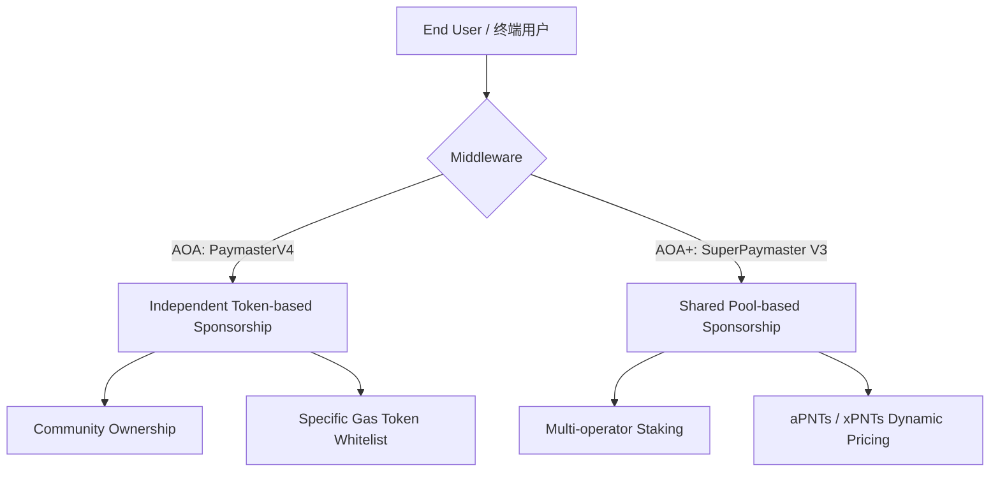

# AAStar SDK (Mycelium Network)

<p align="left">
  
  
  
</p>

**Comprehensive Account Abstraction Infrastructure SDK - Powering the Mycelium Network**
**完整的账户抽象基础设施 SDK - 为 Mycelium 网络提供动力**

---

## 📚 Contents / 目录

- [AAStar SDK (Mycelium Network)](#aastar-sdk-mycelium-network)
  - [📚 Contents / 目录](#-contents--目录)
  - [Introduction / 简介](#introduction--简介)
    - [Core Features / 核心特性](#core-features--核心特性)
  - [SDK Architecture / 架构设计](#sdk-architecture--架构设计)
    - [Paymaster Models / 代付模型](#paymaster-models--代付模型)
  - [Installation / 安装](#installation--安装)
  - [Quick Start / 快速开始](#quick-start--快速开始)
    - [End User Gasless Transaction / 终端用户 Gasless 流程](#end-user-gasless-transaction--终端用户-gasless-流程)
  - [Testing Commands / 测试命令](#testing-commands--测试命令)
    - [SDK Regression (Using SDK Clients)](#sdk-regression-using-sdk-clients)
    - [Full Protocol Regression (Anvil Dedicated)](#full-protocol-regression-anvil-dedicated)
  - [Academic Research / 学术研究](#academic-research--学术研究)
  - [Support / 支援](#support--支援)

---

## Introduction / 简介

**AAStar SDK** is a high-integration toolkit for the Mycelium network. We've refactored 17 fragmented modules into 7 professional core packages, providing a unified, high-performance, and easy-to-maintain development experience.

**AAStar SDK** 是 Mycelium 网络的高集成度开发工具包。我们将原有的 17 个碎片化模块重构为 7 个专业核心包，旨在提供统一、高性能且易于维护的开发体验。

### Core Features / 核心特性

- ✅ **Role-Based Clients**: Specific APIs for End Users, Communities, Operators, and Admins. (**角色化客户端**)
- ✅ **Infrastructure Ready**: Deep integration with SuperPaymaster and EOA Bridge. (**基础设施就绪**)
- ✅ **Seamless User Experience**: Gasless transactions via community credit system. (**无感交互体验**)
- ✅ **DVT Security Module**: Decentralized verification and aggregate signatures. (**DVT 安全模块**)
- ✅ **Scientific Reproducibility**: Version-locked for academic research. (**科学可复现**)

---

## SDK Architecture / 架构设计

AAStar SDK 采用 **「装饰器 (Actions-Decorator)」** 模式。它将低层次的合约交互与高层次的业务逻辑解耦，为生态系统中的四种角色提供专属的 Client 封装。

### Paymaster Models / 代付模型

SDK 目前完美支持两种核心代付逻辑，旨在覆盖从“中心化运营”到“去中心化社区”的全场景：



| Client / 客户端 | Targeted Developer / 目标开发者 | Core Responsibility / 核心职责 |
| :--- | :--- | :--- |
| **`EndUserClient`** | dApp Developer | Gasless UX (AOA/AOA+), Smart Account management |
| **`CommunityClient`** | Community/DAO Admin | Auto-onboarding, xPNTs deployment, SBT & Reputation |
| **`OperatorClient`** | Node/Operator | SuperPaymaster (AOA+) Staking, Paymaster (AOA) management |
| **`AdminClient`** | Protocol Admin | DVT aggregations, Slashing, Global parameters |

---

## Installation / 安装

```bash
pnpm install @aastar/sdk @aastar/core viem
```

---

## Quick Start / 快速开始

### End User Gasless Transaction / 终端用户 Gasless 流程

```typescript
import { createEndUserClient } from '@aastar/sdk';

const user = createEndUserClient({ 
  account, 
  paymasterUrl: 'https://paymaster.aastar.io' 
});

// Send sponsored transaction / 使用社区信用代付 Gas
await user.sendGaslessTransaction({
  to: TARGET_ADDR,
  data: CALL_DATA
});
```

---

## Testing Commands / 测试命令

### SDK Regression (Using SDK Clients)
```bash
pnpm run test:full_sdk
```

### Full Protocol Regression (Anvil Dedicated)
```bash
pnpm run test:full_anvil
```

---

## Academic Research / 学术研究

The SDK supports doctoral data collection for the SuperPaymaster paper. Official experiment logger is available at `scripts/19_sdk_experiment_runner.ts`.

本 SDK 支撑了 SuperPaymaster 论文的博士实验数据采集。官方实验记录器位于 `scripts/19_sdk_experiment_runner.ts`。

---

## Support / 支援

- **Documentation**: [docs.aastar.io](https://docs.aastar.io)
- **GitHub**: [AAStarCommunity/aastar-sdk](https://github.com/AAStarCommunity/aastar-sdk)

MIT © AAStar Community
