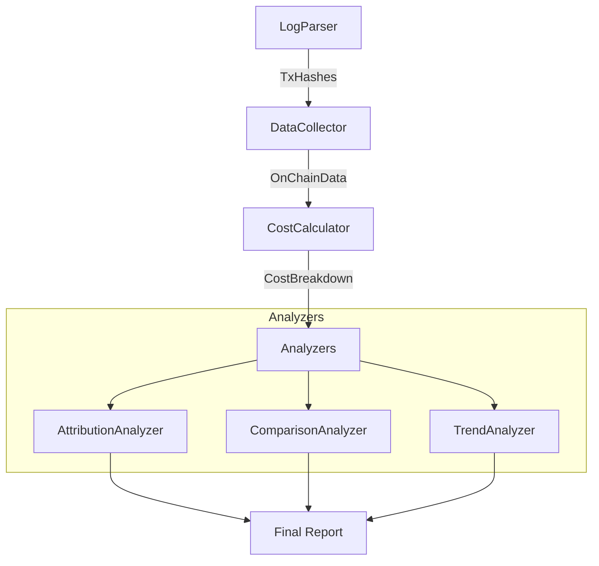

# 📊 AAStar Gas Analytics

Advanced gas analysis and cost attribution engine for AAStar Paymaster ecosystem.

## Features

- **Double-Layer Analysis**:
  - **Intrinsic Layer**: Pure EVM gas consumption and efficiency (Academic view).
  - **Economic Layer**: Real-world USD costs, protocol revenue, and profit margins (Business view).
- **Competitor Benchmarking**: Comparison against L2s (Optimism, Arbitrum) and other Paymasters (Alchemy, Pimlico).
- **Trend Analysis**: Historical gas price trends and optimal execution windows.
- **Profit Tracking**: Accurate calculation of protocol profit (`Markup + Buffer - Cost`).

## Quick Start

1. **Configure Environment**
   Ensure `.env.sepolia` (or relevant network env) exists with RPC URL:
   ```env
   SEPOLIA_RPC_URL=https://...
   ```

2. **Run Analysis**
   ```bash
   # Analyze recent transactions from logs
   npx tsx packages/analytics/src/gas-analyzer-v4.ts
   
   # Analyze specific transaction hash (Development)
   npx tsx packages/analytics/src/cli.ts analyze 0x...
   ```

## Architecture



## detailed Metrics

### Protocol Profit
Profit is calculated as:
```
Profit = UserPaidUSD - L1GasCostUSD
```
Where `UserPaidUSD` is derived from:
- **SuperPaymaster**: `aPNTsConsumed * aPNTsPrice ($0.02)`
- **Paymaster V4**: `TokenCost` (USD value) or `ETH Cost`

### L2 Simulation
Simulates cost if the same UserOp were executed on Optimism:
```
L2Cost = (ExecutionGas * L2GasPrice) + (CalldataSize * L1GasPrice * Scalar)
```

## License
MIT
