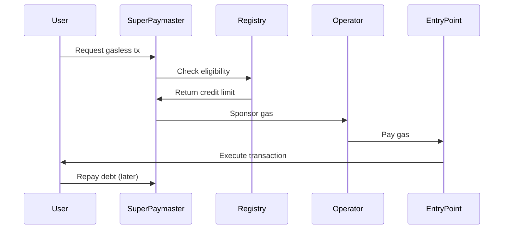

# SuperPaymaster (AOA+)

Advanced On-chain Accounting Paymaster with credit system.

## Overview

SuperPaymaster is AAStar's innovative gas sponsorship solution that enables truly gasless transactions through an on-chain credit system.

## Key Features

### 1. Credit-Based System

Users get gas credit based on:
- **SBT Ownership**: Community membership tokens
- **Reputation Score**: On-chain reputation
- **Historical Behavior**: Past transaction patterns
- **Community Rules**: Custom eligibility criteria

### 2. Operator Network

Decentralized network of Paymaster operators who:
- Stake GTokens to participate
- Deposit funds for gas sponsorship
- Earn fees from communities
- Get slashed for misbehavior

### 3. Community Governance

Communities can:
- Set their own eligibility rules
- Configure credit limits
- Manage operator selection
- Customize fee structures

## How It Works



## Architecture

### Components

1. **SuperPaymaster Contract**: Core logic for gas sponsorship
2. **Registry**: Manages communities, operators, and users
3. **GTokenStaking**: Operator stake management
4. **ReputationSystem**: On-chain reputation tracking

### Credit Calculation

```typescript
credit = baseCreditLimit 
  * reputationMultiplier 
  * communityBonus 
  - outstandingDebt
```

## Usage Example

```typescript
import { createEndUserClient } from '@aastar/core';
import { getPaymasterAndData } from '@aastar/paymaster';

// 1. Check eligibility
const user = createEndUserClient({...});
const eligible = await user.checkEligibility(communityAddress);

if (!eligible) {
  throw new Error('Not eligible for gasless transactions');
}

// 2. Get credit limit
const creditLimit = await user.getCreditLimit();
console.log('Available credit:', formatEther(creditLimit));

// 3. Create UserOperation with paymaster data
const paymasterAndData = getPaymasterAndData(userOp, {
  paymasterAddress: CONTRACTS.sepolia.superPaymaster,
  communityAddress,
  xPNTsAddress: CONTRACTS.sepolia.xPNTsToken,
  verificationGasLimit: 100000n,
  postOpGasLimit: 50000n,
});

// 4. Submit gasless transaction
const txHash = await submitUserOperation({
  ...userOp,
  paymasterAndData,
});
```

## Benefits

### For Users
- ✅ No need to hold ETH for gas
- ✅ Seamless transaction experience
- ✅ Credit-based system (pay later)
- ✅ Community-specific benefits

### For Communities
- ✅ Attract more users
- ✅ Customizable rules
- ✅ Better user retention
- ✅ Governance control

### For Operators
- ✅ Earn fees from gas sponsorship
- ✅ Decentralized network
- ✅ Stake-based participation
- ✅ Performance incentives

## Comparison with Traditional Paymasters

| Feature | Traditional Paymaster | SuperPaymaster (AOA+) |
|---------|----------------------|----------------------|
| Gas Sponsorship | ✅ | ✅ |
| Credit System | ❌ | ✅ |
| Decentralized | ❌ | ✅ |
| Community Governance | ❌ | ✅ |
| Reputation-Based | ❌ | ✅ |
| Operator Network | ❌ | ✅ |

## Learn More

- [Operator API](/api/roles/operator) - Become an operator
- [Community API](/api/roles/community) - Set up gas sponsorship
- [End User API](/api/roles/enduser) - Use gasless transactions

## Next Steps

- [EOA Rainbow Bridge](/guide/concepts/rainbow-bridge)
- [Reputation System](/guide/concepts/reputation)
- [Quick Start](/guide/quick-start)
